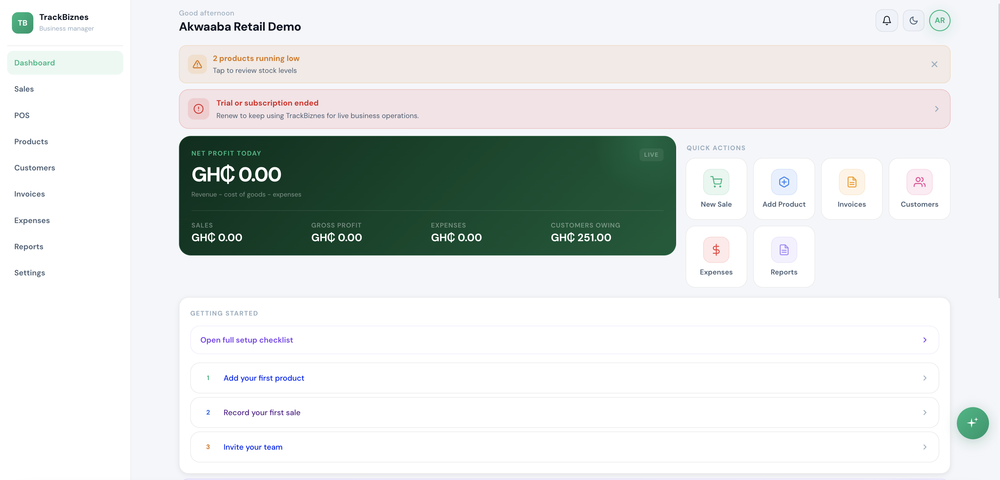
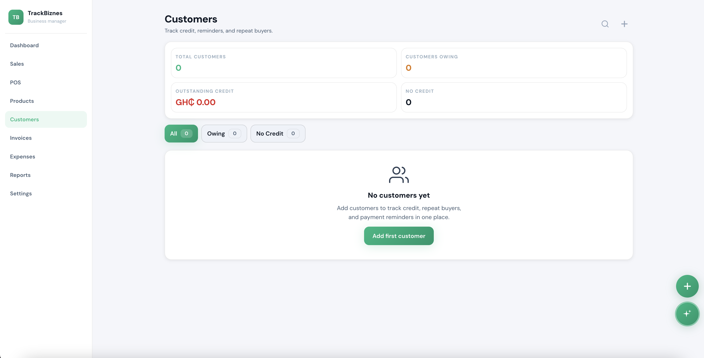
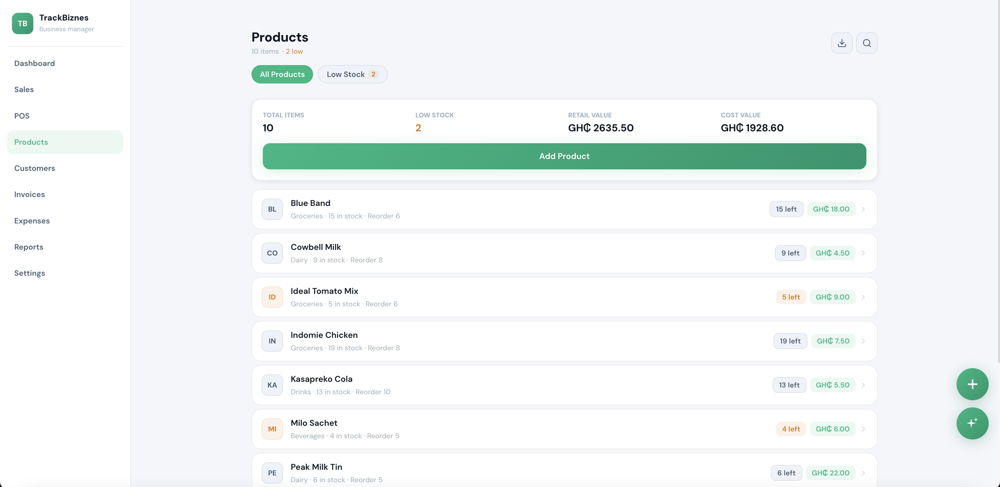
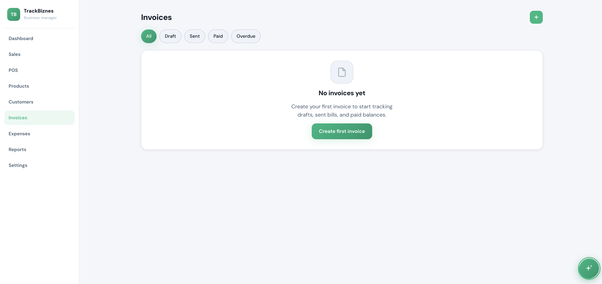
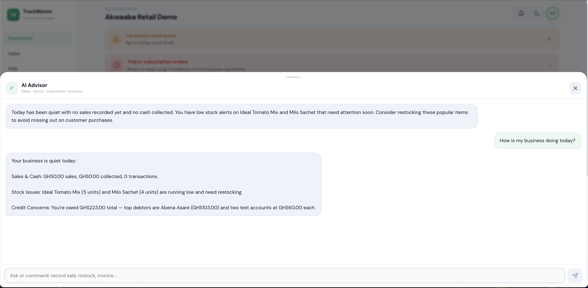

# Biz Manager Dashboard

A full-stack business management dashboard for managing customers, sales, invoices, expenses, inventory, staff, and reports.

## Overview

Biz Manager Dashboard is a portfolio demo business operations system. It shows how a small business can manage records, track daily activity, create invoices, monitor expenses, and view summaries from a clean dashboard experience.

The project is split into a Next.js frontend and an Express API backend, with Supabase used for database access and SQL migrations.

## Features

- Dashboard overview with business activity summaries
- Customer records and customer detail views
- Product and inventory management
- Sales and POS workflows
- Expense tracking
- Invoice creation, invoice detail views, and PDF/email helper logic
- Reports, summaries, and loan-readiness views
- Staff, account, audit, support, and subscription settings screens
- Food-service menu, orders, and kitchen-oriented workflows
- Search, filtering, and form validation across business records
- Responsive Next.js UI with offline/PWA-oriented support

## Tech Stack

- Next.js 14
- React 18
- TypeScript
- Tailwind CSS
- Node.js
- Express
- Supabase
- PostgreSQL migrations
- Vitest
- Playwright

## Screenshots

### Dashboard



### Customers



### Products



### Invoices



### AI Advisor



## What This Project Proves

This project shows the ability to build full-stack business dashboards with CRUD workflows, database logic, forms, responsive UI, authentication-aware flows, reporting screens, and practical business features.

## Getting Started

Install and run the backend:

```bash
cd backend
npm install
npm run dev
```

Install and run the frontend:

```bash
cd frontend
npm install
npm run dev
```

The backend defaults to `http://localhost:4000` and the frontend defaults to `http://localhost:3000`.

## Environment Variables

See `.env.example` for placeholder environment variable names. Do not commit real secrets or local `.env` files.

## Status

Portfolio demo project for full-stack freelance work, dashboard development, and AI/coding evaluation gig applications.

## Note

This is a cleaned public portfolio version of a private project. The original development repo is private, but this version is prepared to demonstrate the app structure, features, UI, and implementation approach.
